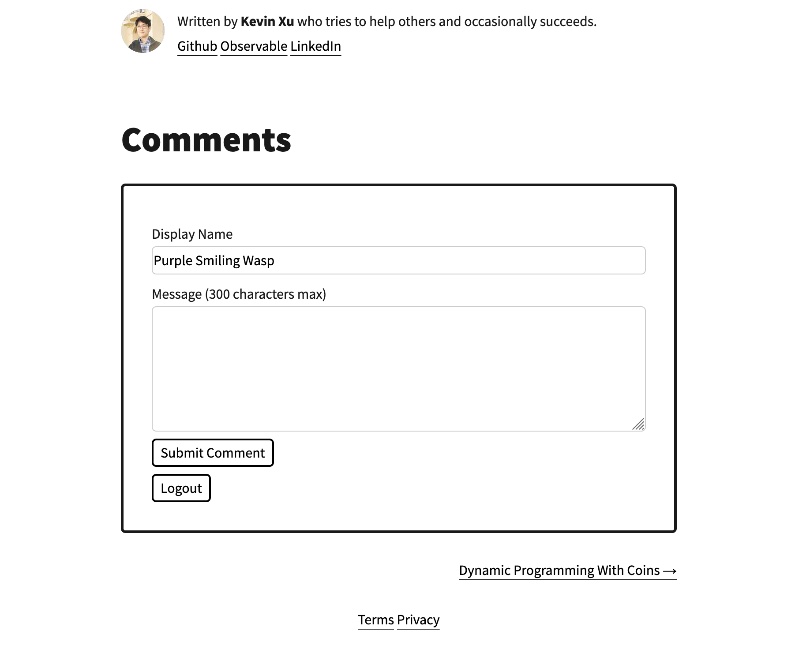
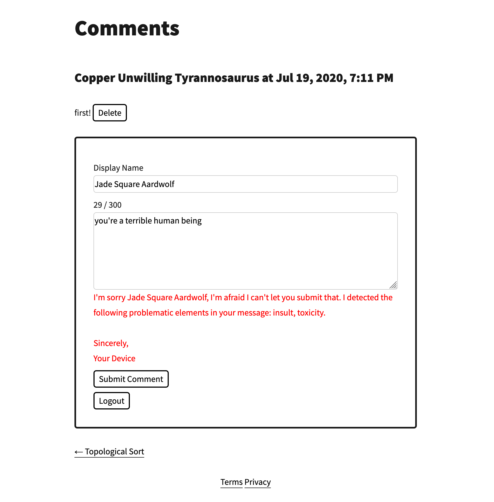
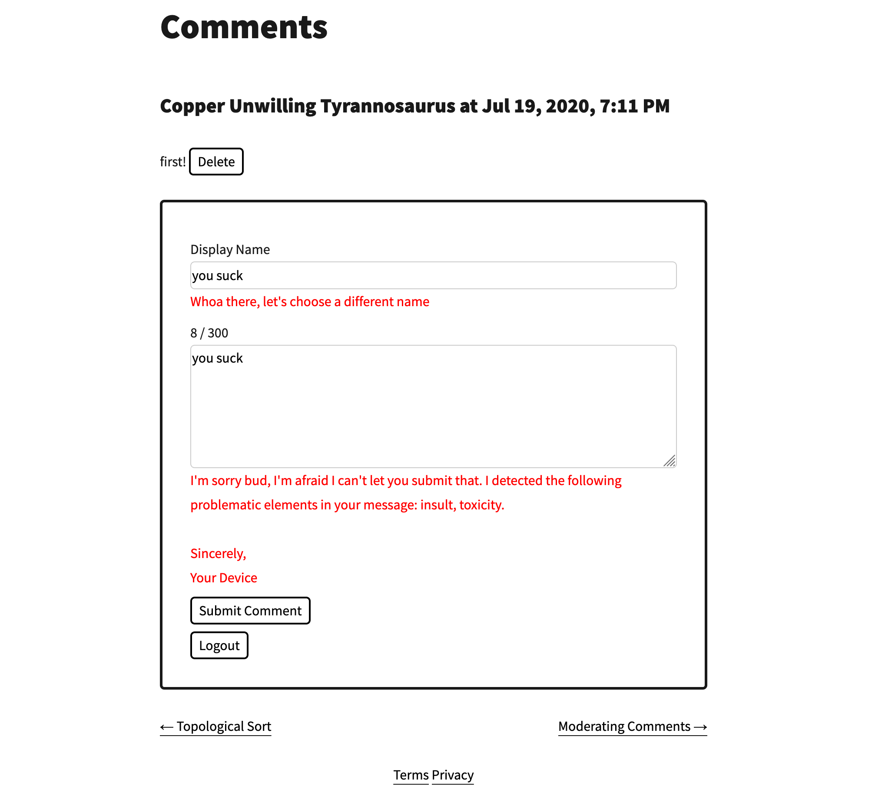

We've got a comments system! Sure, my wife's the only other person who reads this blog (hi honey!), but I was curious about how I might implement comments, so here we are.



## Comments As A Service
Of course, we've got good ol' [Disqus](https://en.wikipedia.org/wiki/Disqus) for what I imagine to be a turnkey solution for comments, but that [Criticism, privacy, and security concerns](https://en.wikipedia.org/wiki/Disqus#Criticism,_privacy,_and_security_concerns) section doesn't exactly inspire confidence. Besides, the point is: I want to try making a comments system myself.

## Product Requirements
As any good software engineer knows, the key to a pleasant development experience is to spend time to lay out the product requirements before diving into implementation. Maybe one day I'll be a good software engineer. Here's the list of requirements I've come up with ex post facto:

1. Spam prevention
2. Content moderation
3. Comment deletion
4. Comment anonymity (via custom display names)

### Spam Prevention
The first thing I think of re: spam prevention is [reCAPTCHA](https://www.google.com/recaptcha/intro/v3.html). While I'm sure it's very helpful for services that handle significant traffic, it seems a bit overkill for this blog, especially given the [privacy tradeoffs](https://www.fastcompany.com/90369697/googles-new-recaptcha-has-a-dark-side) involved.

Instead, I figured putting comments behind an auth system would do the trick. Yeah, I hear you. "Boooo, you're making users create a username/password just to comment?" No username/password required, thanks to [Magic](https://magic.link/)! The only thing users need is an email address.

### Content Moderation
For those rare instances when a user other than my wife writes a comment (or maybe especially when my wife writes a comment?), it'd be helpful to have some kind of moderation mechanism other than me manually reviewing comments.

Enter [TensorFlow.js](https://www.tensorflow.org/js) and their [text toxicity detection model](https://github.com/tensorflow/tfjs-models/tree/master/toxicity), which enables on-device ML classification. This is a win for:

1. My wallet, because it saves me server costs for processing the text; and
2. The user's privacy, because only their device sees their toxic drafts of comments.

See below for one user's potentially traumatizing comment:



Thanks for looking out for me, J.S. Aardwolf's computer/phone.

### Comment Deletion
I'm a supporter of the right to be forgotten.


After all, let he/she who is without an embarrassing Xanga page from when they were 10 cast the first stone. This was also one of my motivations for setting up an auth system. Wouldn't want users to be able to delete other users' comments. After all, weren't we all heartbroken when that sweet Xanga page we made with background music and rainbow font was deleted when Xanga shut down all those years ago? So proud.

### Custom Display Names
Who says anonymity is dead? Shout out to Andrea Sonny's [Unique Names Generator](https://github.com/andreasonny83/unique-names-generator#readme) for such a full-featured project. But of course, if you don't like the randomly generated name, feel free to create your own.

Aha! I'll just make my display name toxic. Not so fast, pal:


## Implementation
Comments are stored in [Cloud Firestore](https://firebase.google.com/docs/firestore/). As mentioned above, [Magic](https://magic.link/) (in conjunction with [Firebase Auth](https://firebase.google.com/docs/auth)) take care of authentication. All in all, I think this'll work exceedingly well for low-volume traffic and become ridiculously expensive if this ever takes off (the usual story re: serverless). Maybe I'll talk about the auth system in another post, but right now, the TensorFlow.js integration is top-of-mind for me, so I want to address that here.

### TensorFlow.js Integration
Developing with the pre-trained text toxicity model was extremely pleasant. Just needed to `npm install` a few packages and I was off to the races.

Building the JavaScript bundles for production was another story. I went on the wildest of goose chases trying to figure out why the text toxicity model kept erroring out in the production build, but worked fine in development mode.

For some reason, Babel's `classCallCheck` throws an error within `tensor.js` -- I'm guessing there's a function in there that doesn't comply with the ES6 class spec. On the off-chance that I can save any of you some time: the way to exclude a package from Babel transpilation in a Gatsby site is to customize the Webpack config: https://www.gatsbyjs.org/docs/add-custom-webpack-config/. Specifically, here's my exclude function:

```javascript
exclude: modulePath => !(/node_modules\/@tensorflow/.test(modulePath))
```

Worked great after that.