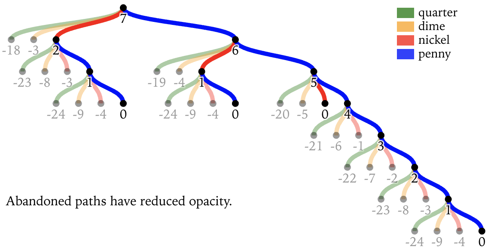

Dynamic programming is tricky. Here's my attempt at visualizing the thought process. Underlying code, live examples, and full walkthrough available in this [Observable Notebook](https://observablehq.com/@khxu/dynamic-programming-with-coins).

Pictured above is a [directed acyclic graph](https://en.wikipedia.org/wiki/Directed_acyclic_graph) that shows the possible paths for making change for $0.07 using quarters, dimes, nickels, and pennies.