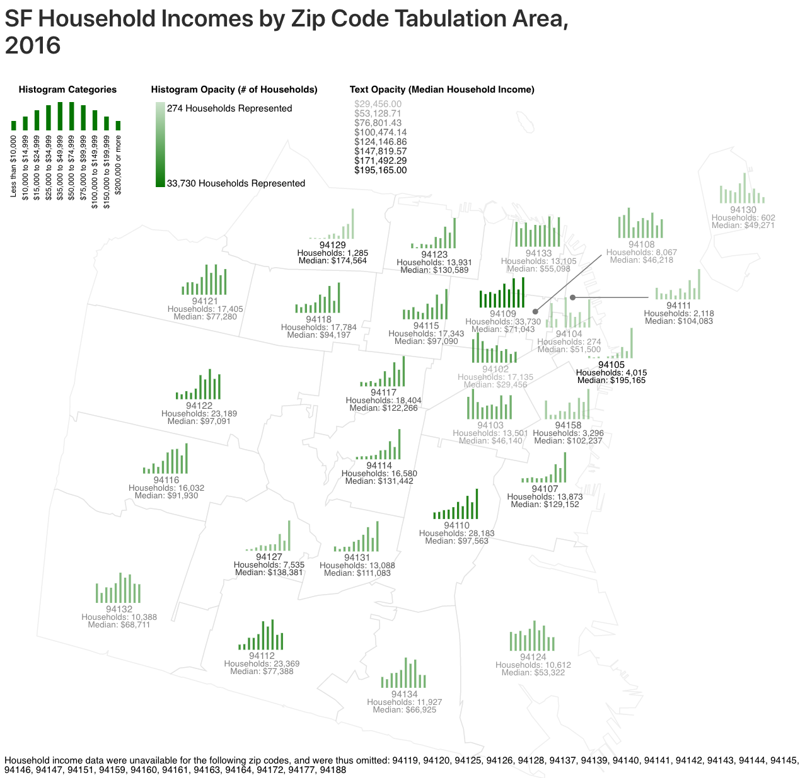

Ah, post #1 in a fresh, evergreen blog. Whitespace as far as the eye can see. Let's put an end to that.

Above is a data visualization of 2016 household incomes in San Francisco by [Zip Code Tabulation Area (ZCTA)](https://en.wikipedia.org/wiki/ZIP_Code_Tabulation_Area), made with D3.js. Underlying code available in this [Observable Notebook](https://observablehq.com/@khxu/san-francisco-zip-code-tabulation-areas-by-household-incom).

This visualization uses text opacity and histogram opacity to independently convey the number of households represented and the median incomes of those households in each ZCTA. The more households, the more opaque the histogram. The higher than median income, the more opaque the text. Thus, if a ZCTA's histogram looks nearly transparent, but its text is opaque, this means that the ZCTA holds relatively few households with a relatively high median income -- looking at you, 94129 (Presidio) and 94105 (Financial District).

A couple of observations that jumped out to me:
- 94102 (Tenderloin), 94103 (Mission), and 94104 (Chinatown) neighbor ZCTA's with much higher median household incomes. I wonder what's the cause of this disparity. Do those areas have a disproportionate number of affordable housing projects?
- The histograms aren't bell curves -- they're generally skewed left, which I suppose makes sense, since the cost of living in SF is so high. I'm very curious about 94133 (Chinatown/North Beach), though, as that area seems to have a pretty much even distribution of household incomes.