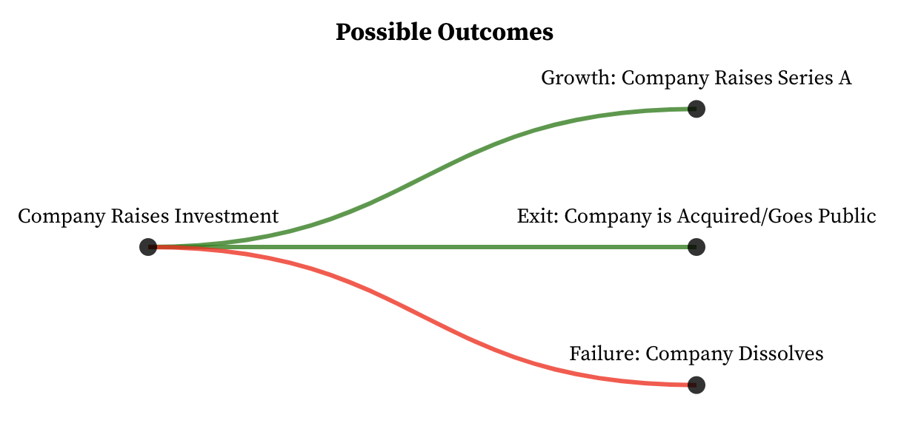
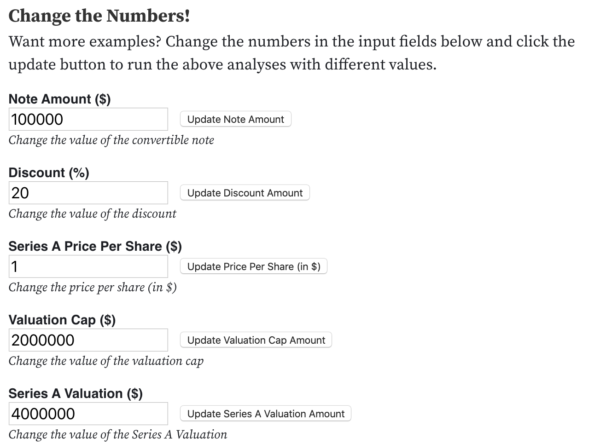

It's a tough road for early stage startups raising funding from investors. The legalese contained in the instruments themselves (e.g., convertible notes, [SAFEs](https://www.ycombinator.com/documents/#safe), [KISSes](https://500.co/kiss/), etc.) don't make things any easier.

Here's an [Observable Notebook](https://observablehq.com/@khxu/investment-instruments-terms-glossary) with editable inputs where you can run through your own examples of different investment terms, and see how the outcomes change.

