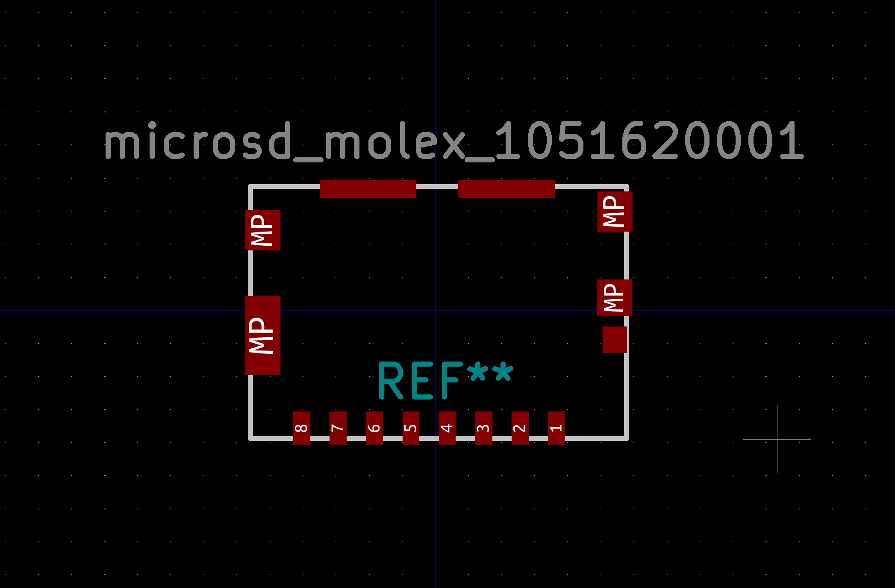
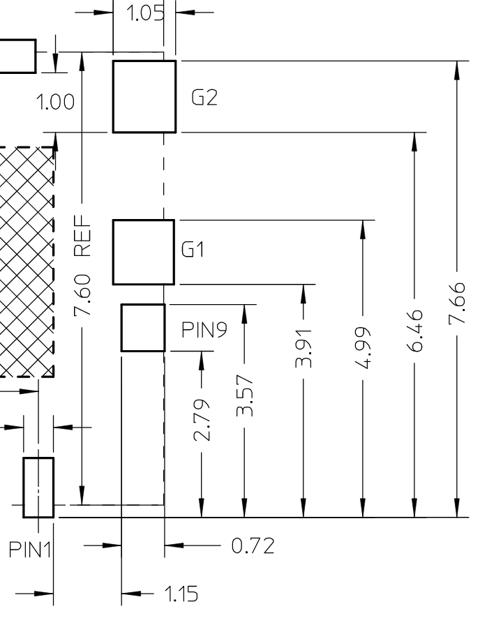
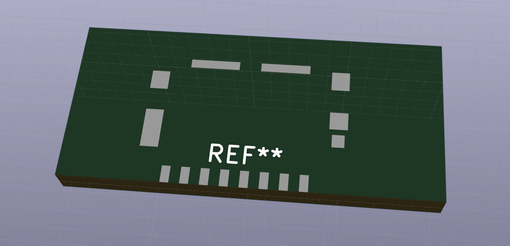
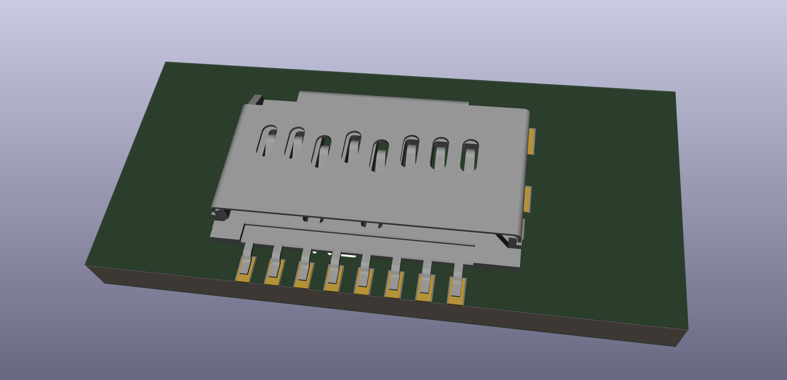

*tl;dr: Footprint available here: https://github.com/khxu/microsd_molex_1051620001. Hope I save you some time. Disclaimer: the footprint seems to match the 3D model, but no guarantees about its accuracy. Make sure you double check before using it. Otherwise, this footprint will definitely not save you time.*

*Also should've done this earlier, but I just searched GitHub, and looks like there's an Eagle library for the part by @crako1t: https://github.com/crako1t/Molex_Micro_SD. In theory there's a way to convert Eagle libraries to KiCad files (https://github.com/lachlanA/eagle-to-kicad-libs), but not sure how about the results.*

## Part 1051620001
I'm working on an embedded project that requires a microSD card for storing data. After doing some extensive research using Digikey's parametric search tool (read: sort by lowest price) I found what I was looking for: [1051620001](https://www.digikey.com/product-detail/en/molex/1051620001/WM14405CT-ND/6133135) (guess the marketing department took a vacation when they were coming up with names that week), a microSD connector for $0.92. Sure, it's no [TF-015](https://lcsc.com/product-detail/Card-Sockets_TF-015_C113206.html), available for a ridiculous ~$0.16, but I figure I'd rather support a small, indie hardware startup like [Molex](https://en.wikipedia.org/wiki/Molex).

KiCad is an amazing tool for creating PCBs. Like I always say, if it's good enough for [CERN](https://home.cern/news/news/computing/kicad-software-gets-cern-treatment), it's good enough for me. Usually, my workflow is:

1. Create a schematic using the built-in symbols library.
2. Associate symbols to footprints using the built-in footprints library.
3. Google around for symbols and footprints not found in the built-in libraries.

Cue my surprised pikachu face when I couldn't find a footprint for good ol' 1051620001. That's okay. How hard can making a footprint be?

It wasn't the *worst* way to spend 2 hours of my life, but I'm not in a hurry to do it again. Ultimately, it was a reminder of how painful performing basic arithmetic can be. Maybe I've grown too used to the instant gratification of the JavaScript ecosystem, where, for any problem you're experiencing, no matter how esoteric, someone's already made an open source package for it with 10K+ stars on GitHub.

## Creating a Footprint

If you haven't tried it before, creating a footprint involves reading the measurements from a dimensioned drawing (hopefully found in the datasheet for your part). Here's a section from 1051620001's [drawing](https://www.molex.com/pdm_docs/sd/1051620001_sd.pdf):

From this section, we can tell that the copper pad for G1 needs to be a 1.05mm x 1.08mm rectangle with its bottom edge 3.91mm away from the bottom edge of the part. That's enough to plug into the relevant fields in KiCad, so we just need to rinse and repeat for each of the remaining pads. In the end, we'll have something like this:

I haven't received the physical parts yet, so I can't check whether they actually fit, but will update when I do. The footprint seems to align nicely with the 3D model, though, so I'm hopeful.

## Next Steps

There has to be a way to automate this process. Dimensioned drawings from datasheets are drawn to scale. We should be able to extract the pads along with their dimensions (computer vision?) and output KiCad footprint files.