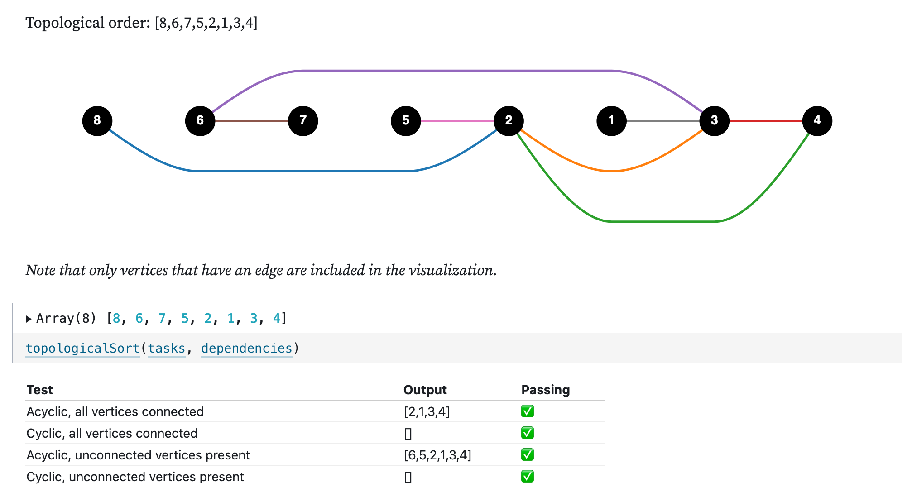

Putting stuff in the right order is hard. For example, say you want to start blogging regularly as a way to document your thought process. Here are steps you could take:

1. Start a blog.
2. Write and post a few articles with data visualizations.
3. Panic about making a career switch into software engineering.
4. Practice technical interview questions on nights and weekends.
5. Move with your partner 400 miles to your new job.
6. Don't write another post for 7 months.

I wouldn't recommend those steps. While I don't regret any of it, I also fell woefully short of my goal of blogging regularly.

All that said, I've finally done some more writing. This [Observable Notebook](https://observablehq.com/@khxu/topological-sort) goes through my implementation of topological sort that *doesn't* use a graph class.

