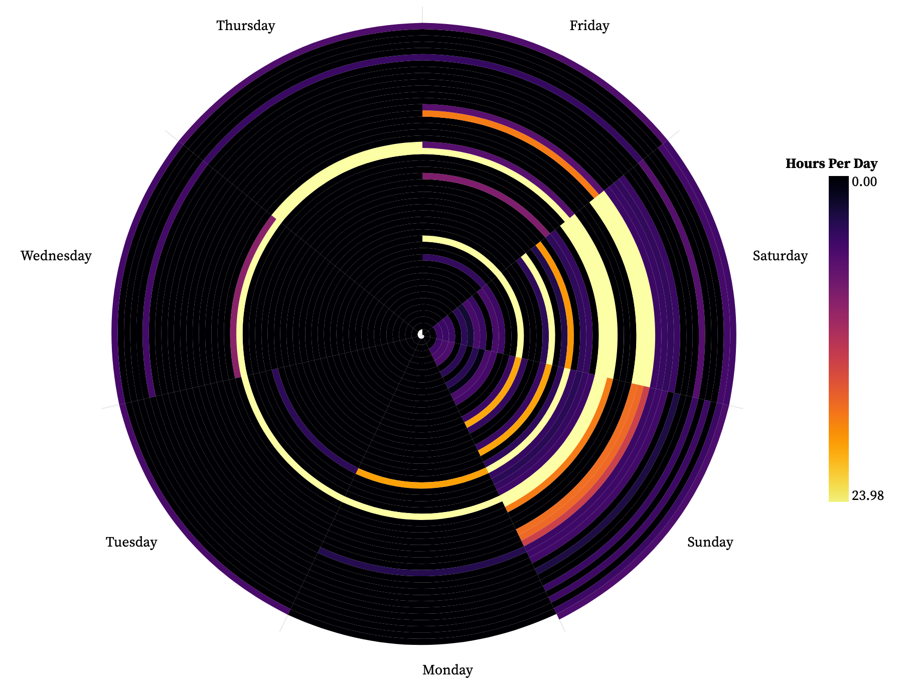
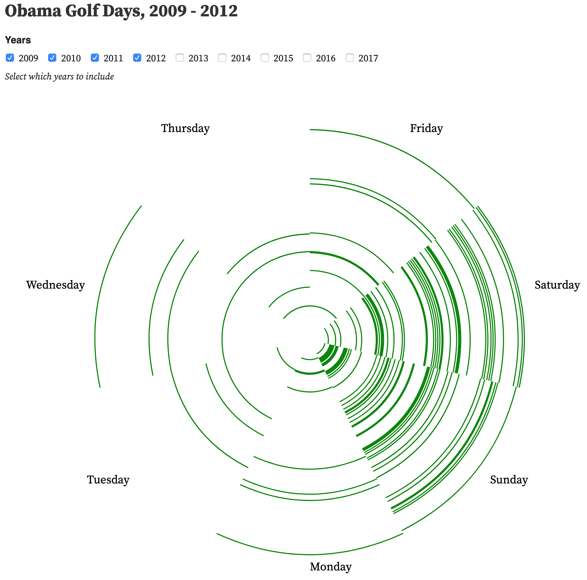
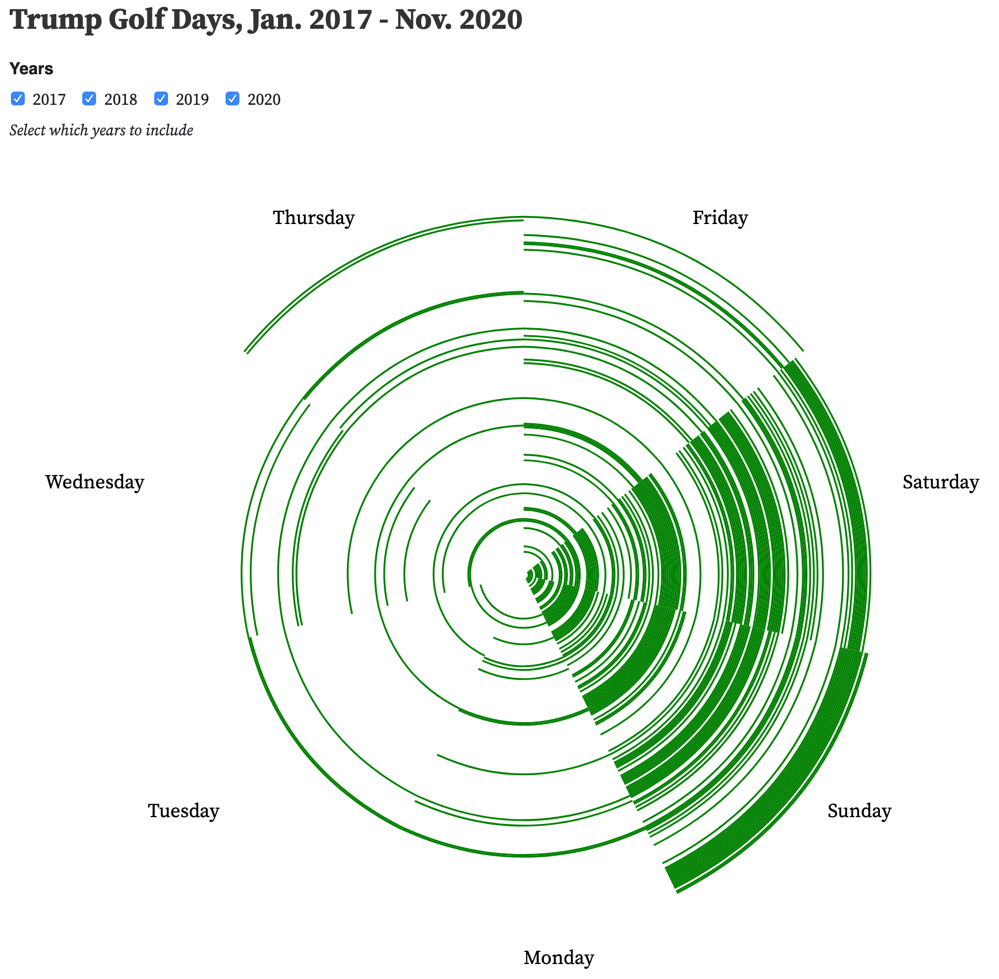

Congrats to Joe Biden and Kamala Harris! I can't be sure what the future holds, but Biden probably won't run up as high of a golf bill as Trump. Here's a spiral heat map of the number of hours Trump spent at a golf club during each day of his presidency, from January 20, 2017 to November 7, 2020 (**[the day every network called the election for Biden](https://www.usatoday.com/story/news/nation/2020/11/07/giuliani-holds-press-conference-four-seasons-total-landscaping/6209235002/)**):

[Observable Notebook](https://observablehq.com/@khxu/trump-golf-course-time-spiral-heatmap) for you to play with the year filter.

While my day-long bachelor party consisted of disc golf, minigolf, and golf (driving range only), that was the last time I did any of those things. What I'm trying to say is that I'm not an avid golfer, and I have no idea if the above heat map shows a typical golf schedule for someone who is into golf. Fortunately, [Trump Golf Count](https://trumpgolfcount.com/) also provides data on Obama's golf habits, archived from [Obama Golf Counter](http://web.archive.org/web/20171229181219/http://obamagolfcounter.com/).

Of course, here's the [Observable Notebook](https://observablehq.com/@khxu/trump-vs-obama-golf-visits).