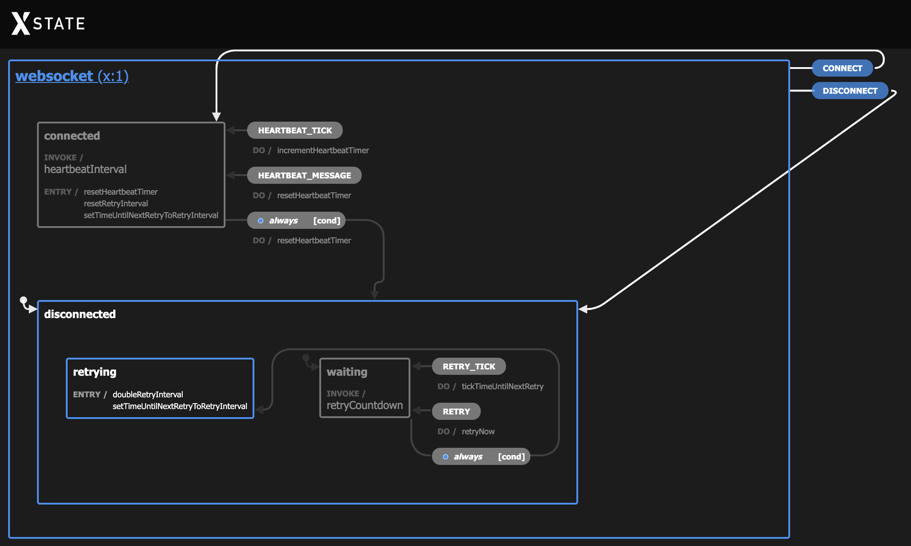

Websockets are awesome, aren't they? Bidirectional messaging with low overhead ([2 - 14 bytes per message](https://hpbn.co/websocket/) for the frame header) -- what's not to love?

## Auto-Reconnect

Well, for any long-lived application, one thing you'll want to have is auto-reconnect behavior. This [Stack Overflow answer](https://stackoverflow.com/questions/22431751/websocket-how-to-automatically-reconnect-after-it-dies) uses a `setTimeout`
to attempt to reconnect every second. However, as one of the follow-up comments mentions, [exponential backoff](https://en.wikipedia.org/wiki/Exponential_backoff) would probably be a better strategy.

## Why XState

Ordinarily, I'd `npm install` [socket.io](https://socket.io/) and call it a day, but this time, I was prototyping a web app that talks to an ESP32 microcontroller as a websocket server, so that's a no-go on any non-C++ server-side code. Additionally, I was still waffling between using React, Svelte, or no framework at all for the frontend, so I ended up encapsulating the logic into a hierarchical state machine in XState, rather than getting locked into a particular `useReducer` / `writable` store / vanilla implementation.

Here's that sweet, sweet Websocket Machine statechart visualized:

## CodeSandbox

https://codesandbox.io/s/xstate-websocket-machine-qegz0

## Websocket Machine Overview

The Websocket Machine has two root-level states:
1. `connected`; and
2. `disconnected`.

Within the `disconnected` state, there are two nested states:
1. `retrying`; and
2. `waiting`.

When the machine is `connected`, a [heartbeat timer](https://en.wikipedia.org/wiki/Heartbeat_%28computing%29) ticks, and the machine will transition to the `disconnected` state if no message arrives within 10 seconds. Each incoming message resets the heartbeat timer.

When the machine is `disconnected`, the machine will wait for the duration of the `retryInterval`, and then try to connect to the websocket server. Upon entering the `retrying` state, the machine will double the `retryInterval` and add anywhere from 0 - 1000 milliseconds to [avoid situations where all of the clients sync up somehow](https://cloud.google.com/iot/docs/how-tos/exponential-backoff), increasing the `retryInterval` for the next connection attempt to a maximum of ~64 seconds.

It's held up well in my testing so far, and thankfully has kept my bundle size small enough for a tiny embedded device to serve while also handling other business logic.